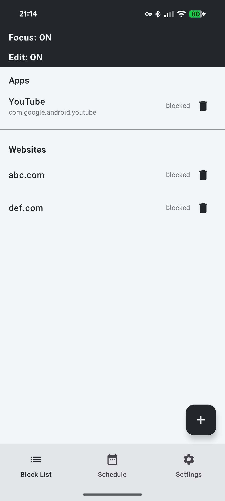
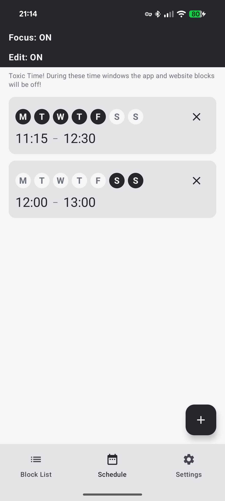
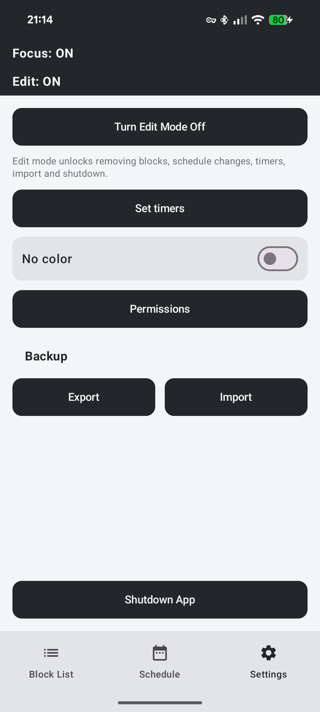

# focus

An Android app & website blocker that makes it hard to cheat on yourself.

## Screenshots

| Block List | Schedule | Settings |
|---|---|---|
|  |  |  |

## How it works

- **Block List** — block apps and websites, each with a daily allowance of 0–120 minutes (0 = fully blocked). Allowances reset at midnight. Adding a block or lowering an allowance is always possible; removing one or raising an allowance requires edit mode.
- **Schedule** — weekly cheat windows during which blocking is paused. Creating or changing them requires edit mode.
- **Edit mode** (Settings) — the anti-impulse guard: tap "Turn Edit Mode On", wait out a cooldown, then confirm within a short window. Both timers are configurable. Every loosening change goes through this ritual.
- **Enforcement** — an Accessibility Service blocks apps and tracks usage, a local VPN blocks websites at the DNS level (including DNS-over-HTTPS bypasses), and Device Admin plus a watchdog service resist uninstalling and permission revocation. Best effort, not a hard lock: a determined user can still disable it via Android settings.

All data stays on the device — no backend, no accounts. Settings can be exported/imported as JSON.

## Install

### From a GitHub Release

Download the `.apk` from the [Releases](../../releases) page, then either:

- **On the phone**: open the downloaded file and tap through the "install unknown apps" prompt (one-time permission for your browser/file manager), or
- **From a computer**, with the phone connected and USB debugging enabled: `adb install -r focus.apk`

Read the [release disclaimer](.github/RELEASE_DISCLAIMER.md) first — the app uses Device Admin, Accessibility and VPN permissions and is intended for your own device only.

### From source

Needs: Android 8.0+ phone with USB debugging, `adb`, and a JDK 17 (Gradle downloads one automatically if missing).

```sh
./gradlew assembleDebug
adb install -r app/build/outputs/apk/debug/app-debug.apk
```

### Permissions

Grant permissions in-app via **Settings → Permissions**, or in one shot via adb:

```sh
adb shell pm grant com.max.focus android.permission.POST_NOTIFICATIONS
# optional, powers the "No color" grayscale toggle
adb shell pm grant com.max.focus android.permission.WRITE_SECURE_SETTINGS
adb shell appops set com.max.focus SYSTEM_ALERT_WINDOW allow
adb shell appops set com.max.focus ACTIVATE_VPN allow
adb shell dpm set-active-admin com.max.focus/.AdminReceiver
# overwrites the accessibility list - append instead if you use other accessibility services
adb shell settings put secure enabled_accessibility_services com.max.focus/com.max.focus.BlockerService
adb shell settings put secure accessibility_enabled 1
```

## Uninstall

Device Admin blocks normal uninstall (that's the point). Over USB:

```sh
adb shell dpm remove-active-admin com.max.focus/.AdminReceiver
adb uninstall com.max.focus
```
